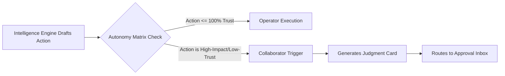

## Purpose

This document outlines the **Approval and Transparency** workflow. 

It defines the exact physical loop that occurs when the Autonomy Engine forces an `Operator` action to degrade into a `Collaborator` draft, requiring a human signature.

---

## 1. The Trigger Phase

The workflow does not begin with a human navigating to a form. It begins when the `Intelligence Layer Processor` generates a draft that exceeds its hard-coded `Autonomy Ceiling`.

---

## 2. The Approval Inbox Phase

The target human (e.g., the Principal) opens their `Approval Inbox`. They are presented with a prioritized queue of **Judgment Cards**.

### The Comparison View
The core of this workflow is the Comparison View on the Judgment Card. A Principal cannot make an informed choice without structural context.
*   **The Baseline (Reality)**: *"Student John has missed 5 consecutive days."*
*   **The AI Draft (Recommendation)**: *"Suspend student pending parent meeting and send Form B3."*

### Human Resolution Options
The Principal must interact with the `Judgment Card` using one of three hard-coded paths:

<FeatureGrid>

<SurfaceCard title="Path 1: Approve (Sign)">
The Principal clicks **Approve**. 
The system instantly executes the drafted dependencies (sending Form B3, locking John's ID card).
</SurfaceCard>

<SurfaceCard title="Path 2: Reject (Erase)">
The Principal clicks **Reject**. 
The AI draft is permanently deleted. The `Recommendation Engine` absorbs this rejection to tune its future Confidence parameters down for similar baseline events.
</SurfaceCard>

<SurfaceCard title="Path 3: Edit (Overwrite)">
The Principal clicks **Edit Draft**. 
They change "Suspend student" to "Issue final warning letter" within the Workspace array. The edited workflow is immediately executed. The delta between the AI's draft and the human's edit is fed back to the `Semantic Processor` for tone and policy tuning.
</SurfaceCard>

</FeatureGrid>

---

## 5. Edge Cases: The Silence Threshold

What happens when a Principal simply ignores the `Approval Inbox`? Mintrix does not allow AI drafts to sit in purgatory indefinitely.

*   **The 48-Hour Escalation**: Every `Judgment Card` possesses a decay timer. If a draft (e.g., *Approve Suspension for Student X*) sits untouched for 48 hours, the system assumes the Principal is compromised or overwhelmed. The card is physically removed from the Principal's Inbox and escalated upward to the `Director/Owner Dashboard` flagged as a `Protocol Abandonment` exception.
*   **The Passive Rejection**: For low-priority Collaborator drafts (e.g., *Suggested Newsletter format*), hitting the 48-hour timeout results in a silent, automatic "Reject." The draft is deleted, and the Transparency Log records: *"Action aborted due to human timeout."*

By forcing these decay timers, the system guarantees operational flow never permanently halts.

---

## 3. The Transparency Log Phase

Whether an action was executed silently by an `Operator` or explicitly signed by a human `Collaborator` in Path 1, it must be recorded.

1.  **Receipt Generation**: The system writes a permanent Event Card to the `Transparency Log`.
2.  **The "View Why" Payload**: Any authorized user can click the receipt. The system unfolds to display the exact logical path:
    *   *Executed by*: Principal Agent 
    *   *Triggered by*: 5-day Absence Policy limit
    *   *Authorization*: Signed by Principal Sarah
3.  **The Reversibility Window**: If the executed action falls within the institution's defined Undo period (e.g., 15 minutes for communications), the `Undo` button remains active. Clicking it attempts a physical rollback of the Substrate (recalling the email, unlocking the ID card). Once the 15 minutes expire, the Undo button permanently grays out.
