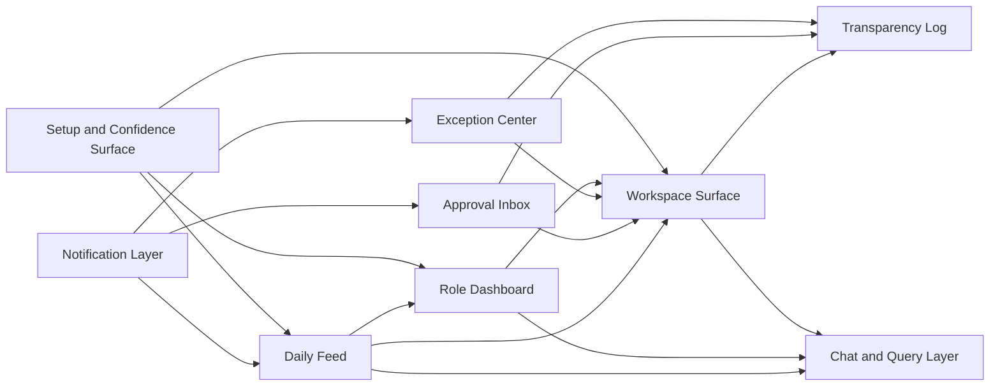

# Mintrix Surface Architecture Map

## Purpose

This document defines the core surface types of the Mintrix product before UI screens are designed.

The goal is not to list pages. The goal is to define the repeatable interaction architecture of the app.

If this document is skipped, screen design will become page-first and module-first. That would weaken the operating-system model and push the product toward ERP behavior.

This document answers:

- what kinds of surfaces exist in Mintrix,
- what each surface is responsible for,
- which personas rely on which surfaces,
- and how the surfaces work together as a coherent product.

---

## Surface Philosophy

Mintrix should not be organized as a navigation shell full of departments and modules.

It should be organized around how intelligence reaches humans:

- what they need to know now,
- what needs judgment,
- what requires action,
- what changed,
- and what the system already did.

This leads to a small number of reusable surface families.

---

## Core Surface Families

<SurfaceCard title="1. Daily Feed" roles={["Teacher", "Principal", "Admin", "Student", "Parent"]}>
### Purpose

The daily feed is the primary ambient surface for a persona's day.

It answers:

- what matters today,
- what changed,
- what needs attention,
- what the AI has already prepared,
- and what should happen next.

### Surface characteristics

- time-aware
- contextual
- proactive
- concise
- mixed content and action

### Typical content blocks

- today's schedule
- risk highlights
- recommendations
- pending approvals
- recent autonomous actions
- upcoming disruptions
</SurfaceCard>

---

<SurfaceCard title="2. Approval Inbox" roles={["Principal", "Admin", "Teacher"]}>
### Purpose

This is the system's formal judgment surface.

It collects actions that the system can prepare but should not finalize without human approval.

### Surface characteristics

- decision-first
- high-context
- low-noise
- clearly reversible where appropriate

### Typical item types

- sensitive parent communication
- escalation recommendations
- event approvals
- substitution approval
- intervention approval
- workflow exceptions needing sign-off
</SurfaceCard>

---

<SurfaceCard title="3. Exception Center" roles={["Principal", "Admin", "Teacher"]}>
### Purpose

This is the surface for active breakdowns, anomalies, and continuity risks.

It is not a dashboard of metrics. It is an operational triage layer.

### Surface characteristics

- severity-based
- action-oriented
- grouped by operational or academic impact
- linked to underlying context and choices

### Typical exception types

- class behind plan
- attendance risk spike
- unresolved event dependency
- staff absence with no substitute
- communication requiring escalation
- setup confidence too low for automation
</SurfaceCard>

---

<SurfaceCard title="4. Role Dashboard" roles={["Owner", "Principal", "Admin", "Teacher"]}>
### Purpose

This is the persona-level summary surface.

Unlike the daily feed, which is time-anchored, the role dashboard is responsibility-anchored.

### Surface characteristics

- summary-oriented
- stable
- responsibility-framed
- drill-down capable

### Typical use

- owner risk overview
- principal academic and operational health
- admin setup and workflow status
- teacher class health overview
</SurfaceCard>

---

<SurfaceCard title="5. Workspace Surface" roles={["Teacher", "Admin", "Principal"]}>
### Purpose

This is the focused execution surface for a specific object or workflow.

This is where the user goes when they need depth, not just awareness.

### Examples

- class teaching workspace
- student intervention workspace
- event workspace
- setup workspace
- notice drafting workspace

### Surface characteristics

- high context density
- clear action ladder
- recommendations alongside manual controls
- visible state and history
</SurfaceCard>

---

<SurfaceCard title="6. Transparency Log" roles={["Principal", "Admin", "Owner", "Teacher"]}>
### Purpose

This is the memory surface for system behavior.

It answers:

- what the AI did,
- why it did it,
- which data it used,
- whether approval was involved,
- and what changed afterward.

### Surface characteristics

- chronological
- filterable
- explanation-aware
- trust-building
</SurfaceCard>

---

<SurfaceCard title="7. Chat and Query Layer" roles={["All personas in controlled ways"]}>
### Purpose

This is the ad hoc conversational surface for exploration, retrieval, and follow-up.

It should not be the product's main operating surface.

### Good uses

- ask for context
- summarize a trend
- retrieve a student or class history
- request a draft
- explain why the system recommended something

### Bad uses

- hiding core workflows inside chat
- forcing users to ask for things the system should proactively surface
</SurfaceCard>

---

<SurfaceCard title="8. Notification and Interruption Layer">
### Purpose

This is the lightweight, cross-surface delivery system for urgency and continuity.

### Examples

- high-severity alert
- event dependency reminder
- approval waiting too long
- schedule disruption
- urgent parent acknowledgment pending

### Design rule

Notifications should route users into the right surface family rather than becoming the workflow itself.
</SurfaceCard>

---

<SurfaceCard title="9. Setup and Confidence Surface" roles={["Admin", "Principal", "Onboarding stakeholders"]}>
### Purpose

This surface family helps the school understand what the system knows, what is missing, and how trustworthy recommendations currently are.

### Surface characteristics

- staged progress
- confidence-aware
- data-gap aware
- instructional without being patronizing
</SurfaceCard>

---

## Surface Relationships

---

## Surface Mapping by Persona

| Persona | Primary surfaces | Secondary surfaces |
| --- | --- | --- |
| Owner | Role dashboard, transparency log | Chat/query, selective exception views |
| Principal | Daily feed, approval inbox, exception center, role dashboard | Workspace surfaces, transparency log |
| Admin | Daily feed, setup/confidence surface, approval inbox, workspace surfaces | Transparency log, exception center |
| Teacher | Daily feed, workspace surfaces, class dashboard | Approval inbox, chat/query |
| Student | Daily feed, learning workspace | Notifications, chat/query |
| Parent | Daily feed, communication/payment task view | Notifications, support query |

---

## Design Rules for Screen Planning

### 1. Design surfaces before pages

The team should first lock the behavior of each surface family.

After that, individual screens can be created as persona-specific instances of those surfaces.

### 2. Reuse surface logic across workflows

For example:

- trip approvals and communication approvals should share the same approval inbox logic
- curriculum drift and event dependency issues should share the same exception logic
- class workspace and event workspace should share the same workspace grammar

### 3. Every proactive action needs a trust companion

Any surface showing recommendations or autonomous actions should be paired with:

- explanation,
- state,
- and traceability.

### 4. Do not let chat absorb the product

Chat is useful, but it should support the main system, not replace it.

### 5. Setup is a real product surface

Onboarding and confidence visibility are part of the product's trust architecture, not internal implementation details.

---

## First-Wave Surface Set

Before detailed UI design, the first-wave surface set should be treated as canonical:

1. Daily feed
2. Approval inbox
3. Exception center
4. Role dashboard
5. Workspace surface
6. Transparency log
7. Setup and confidence surface

These are enough to define the product architecture without prematurely expanding into too many screens.

