## Purpose

This document is the v2 system brain map for Mintrix. It is meant to align product, design, and engineering on the full cognitive shape of the app before detailed UI design begins.

It answers one question:

What are the core systems, agents, loops, and control boundaries that make Mintrix an AI operating system for schools rather than a prettier ERP?

This is a synthesis grounded in:

- the Mintrix foundation documents,
- the audit report in [Mintrix_Document_Aligned_Audit_Report.md](/Users/hitensaxena/.openclaw/workspace/Mintrix_Document_Aligned_Audit_Report.md),
- and the working reference in [Mintrix_Autonomy_Matrix_Personas_System_Map.md](/Users/hitensaxena/.openclaw/workspace/Mintrix_Autonomy_Matrix_Personas_System_Map.md).

---

## Core Thesis

Mintrix is a school operating system with three interacting realities:

1. `Operational reality`
2. `Intelligence reality`
3. `Human judgment reality`

The app succeeds only when those three are connected continuously.

If Mintrix stores records without understanding live school conditions, it becomes ERP software.
If Mintrix recommends actions without trust boundaries, it becomes unsafe.
If Mintrix has intelligence but no clear surfaces for approvals and exceptions, it becomes unusable.

---

## System Brain Map

```mermaid
flowchart TB
    P["School Reality"] --> O["Operational Substrate"]
    O --> I["Intelligence Layer"]
    I --> H["Human Interaction Layer"]
    H --> T["Trust and Governance Loop"]
    T --> I

    P --> P1["Academic rhythm"]
    P --> P2["Operational chaos"]
    P --> P3["Human hierarchy"]
    P --> P4["Parent expectations"]
    P --> P5["Student learning needs"]

    O --> O1["Calendar and timetable"]
    O --> O2["Syllabus and curriculum"]
    O --> O3["Students and assessments"]
    O --> O4["Staff and hierarchy"]
    O --> O5["Attendance"]
    O --> O6["Fees and payments"]
    O --> O7["Events, notices, trips"]
    O --> O8["Setup and configuration"]

    I --> I1["Persona agents"]
    I --> I2["Living curriculum state"]
    I --> I3["Autonomy engine"]
    I --> I4["Recommendation engine"]
    I --> I5["Exception detection"]
    I --> I6["Transparency log"]

    H --> H1["Daily content feed"]
    H --> H2["Approval inbox"]
    H --> H3["Exception dashboard"]
    H --> H4["Chat and query"]
    H --> H5["Role dashboards"]
    H --> H6["AI tutor"]

    T --> T1["Approval boundaries"]
    T --> T2["Override rules"]
    T --> T3["Escalation paths"]
    T --> T4["Operator-safe routines"]

    I1 --> A1["Owner agent"]
    I1 --> A2["Principal agent"]
    I1 --> A3["Admin agent"]
    I1 --> A4["Teacher agent"]
    I1 --> A5["Student agent"]
    I1 --> A6["Parent agent"]

    O1 --> I2
    O2 --> I2
    O3 --> I2
    O7 --> I3
    O8 --> I3
    I2 --> I4
    I3 --> H2
    I5 --> H3
    I6 --> H1
    I6 --> H5
```

---

## The Brain in Plain English

## 1. School reality

Mintrix enters a world defined by:

- live teaching schedules,
- uneven syllabus progress,
- staff absences and substitutions,
- fee follow-ups,
- event chaos,
- parent anxiety,
- and student learning gaps.

That world is not static. It changes every day, often every hour.

Mintrix therefore cannot be designed as a set of isolated modules. It has to think like a continuously operating coordination layer.

## 2. Operational substrate

This is the system’s ground truth.

### Permanent structure

- academic calendar
- sections and grades
- syllabus and subject structure
- fee heads and payment rules
- staff hierarchy and permissions

### Living structure

- substitutions
- new admissions
- notices
- trips and competitions
- ad-hoc payments
- event-specific rosters
- changing operational states

The system becomes more intelligent only if both the permanent structure and the living structure are modeled correctly.

## 3. Intelligence layer

This is where Mintrix stops being software and starts being a thinking partner.

### Core functions

- assemble live context from fragmented school signals
- maintain a living curriculum state
- detect risk and drift
- prepare next steps before users ask
- recommend action where judgment is needed
- execute safe routines where trust already exists
- explain what it did and why

### Main internal engines

| Engine | Role |
| --- | --- |
| `Persona agent layer` | Shapes intelligence to each stakeholder world |
| `Living curriculum engine` | Fuses time, content, teaching, and learning state |
| `Autonomy engine` | Decides whether behavior should be tool, assistant, collaborator, or operator |
| `Recommendation engine` | Converts patterns into contextual next-best actions |
| `Exception engine` | Detects conflicts the system cannot safely resolve |
| `Transparency engine` | Leaves a visible trace of autonomous work |

## 4. Human interaction layer

Humans do not browse Mintrix the way they browse old SaaS software.

They meet the system mainly through:

- `daily context`,
- `prepared work`,
- `exceptions`,
- `queries`,
- and `trust visibility`.

That means the key surfaces are:

- Daily content feed
- Approval inbox
- Exception dashboard
- Transparency log
- Role dashboards
- Chat/query
- AI tutor

## 5. Trust and governance loop

This is the control system that prevents Mintrix from becoming either passive or reckless.

### Questions it must answer

- What can be acted on autonomously?
- What must always require approval?
- What is routine versus reputationally sensitive?
- Who can override what?
- When does the system escalate to a principal instead of an admin or teacher?

Without this layer, autonomy becomes either too weak to matter or too risky to trust.

---

## Persona-to-Agent Map

| Persona | Agent mission | Primary horizon | Main outputs |
| --- | --- | --- | --- |
| Owner | Protect institutional health across campuses | Weekly to quarterly | Executive signals, strategic risk, cross-campus visibility |
| Principal | Maintain academic and operational coherence | Daily to weekly | Briefings, exceptions, approvals, escalation summaries |
| Admin | Keep the school operationally synchronized | Hourly to daily | Queues, task bundles, notices, payments, event workflows |
| Teacher | Teach with context, not fragmentation | Period to day | Teaching plan, student signals, syllabus pace, AI recommendations |
| Student | Learn with personal support | Day to week | Tutor guidance, revision, next actions, motivation |
| Parent | Stay informed and confident | Day to month | Progress visibility, notices, acknowledgments, payments |

---

## Core System Loops

## Loop 1: Teaching loop

Calendar + syllabus + section progress + student signals -> living curriculum state -> teacher recommendations -> teacher action or approval -> transparency log -> next-day context

## Loop 2: Intervention loop

Assessment or attendance signal -> learner risk detection -> teacher and student support recommendations -> parent communication if needed -> outcome feedback into model

## Loop 3: Operations loop

Staff issue, notice, payment issue, or event trigger -> admin/principal preparation -> approvals and exception handling -> execution -> operational closure

## Loop 4: Event loop

Event created -> typed workflow spawns -> notices, rosters, consent, payments, and calendar blocks generated -> conflicts surfaced -> humans resolve what matters -> event closes with full record

## Loop 5: Trust loop

System acts -> human sees what happened -> human confirms or overrides -> confidence increases or rules tighten -> future autonomy adjusts

---

## The Most Important Bridges

These bridges are where Mintrix becomes category-defining.

### Calendar -> syllabus

This bridge creates the living curriculum state.

### Curriculum state -> teacher support

This bridge turns lesson planning and class pacing into context-aware intelligence.

### Curriculum state -> student support

This bridge turns weak performance into proactive tutoring instead of late reaction.

### Event creation -> multi-step workflow generation

This bridge turns chaotic school operations into typed, structured execution.

### AI action -> transparency log

This bridge turns autonomy from opaque automation into visible partnership.

### Exception -> approval

This bridge keeps authority human where consequence is high.

---

## What Must Not Be Lost

The system brain map should protect these non-negotiables:

- Mintrix is not a passive dashboard
- intelligence must be role-shaped
- curriculum must be live, not archival
- setup is part of the product brain, not a one-time admin task
- events are first-class operating workflows
- trust boundaries are design material, not legal fine print

---

## Output of This Artifact

This system brain map should be used to:

- review product scope,
- align design and engineering,
- define data model priorities,
- validate what the first usable surfaces should be,
- and prevent UI work from drifting away from the actual system.

If this map is accepted, the next downstream artifacts should be:

1. detailed autonomy matrix,
2. persona intelligence cards,
3. setup and event architecture map,
4. living curriculum definition memo,
5. trust and control blueprint.
