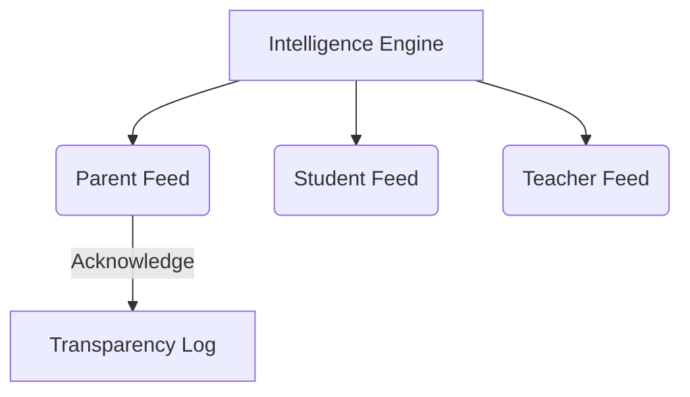

## Purpose

The **Daily Feed** is the primary ambient awareness surface of Mintrix. It is designed for frictionless consumption. 

Unlike traditional feeds that act as endless scrolling social networks, the Mintrix Daily Feed is an ephemeral, chronologically sorted array of `Event Cards` detailing only what the user *must know* to survive the next 24 hours of execution.

---

## 1. Structural Philosophy

The UI of the Daily Feed embraces the "Editorial Intelligence" design language:
*   **No-Line Surfaces**: Cards sit on a pristine canvas with soft drop-shadows (elevation levels) rather than hard pixel borders.
*   **Compression**: The feed ruthlessly compresses data. If 5 students are absent, it does not show 5 cards. It shows one card: *"5 Absences in Section 10A."*

## 2. Interaction Model

The Daily Feed is strictly a **Read and Acknowledge** surface. Users cannot author content, draft forms, or edit database rows directly from the Feed.

<FeatureGrid>

<SurfaceCard title="The Acknowledgment Cycle">
Every critical card in the feed features an "Acknowledge" or "Action" button. Once clicked, the card *physically animates* off the feed into the archive. This ensures the Daily Feed functions like a true inbox (Inbox Zero) rather than an infinite scroll. 
</SurfaceCard>

<SurfaceCard title="The Workspace Portal">
If a feed item requires deep work (e.g., *"Midterm syllabus draft is ready"*), clicking the card does not expand it. Instead, it acts as a portal, instantly transporting the user to the corresponding `Workspace Surface` to begin heavy execution.
</SurfaceCard>

</FeatureGrid>

---

## 3. Data Ingestion Architecture

The `Daily Feed` does not query raw database components. It solely queries the `Intelligence Layer Processor`.

1.  **Teacher Inputs Reality**: Teacher logs a discipline issue in the `Workspace`.
2.  **Processor Evaluates**: The `Principal Agent` determines the issue is severe and warrants a signature (`Collaborator` mode).
3.  **Feed Generation**: It writes an `Awareness Card` to the offending Student's Daily Feed (*"You have received a formal warning."*) and an `Action Card` to the Parent's Daily Feed (*"Signature required for Disciplinary Notice."*)

