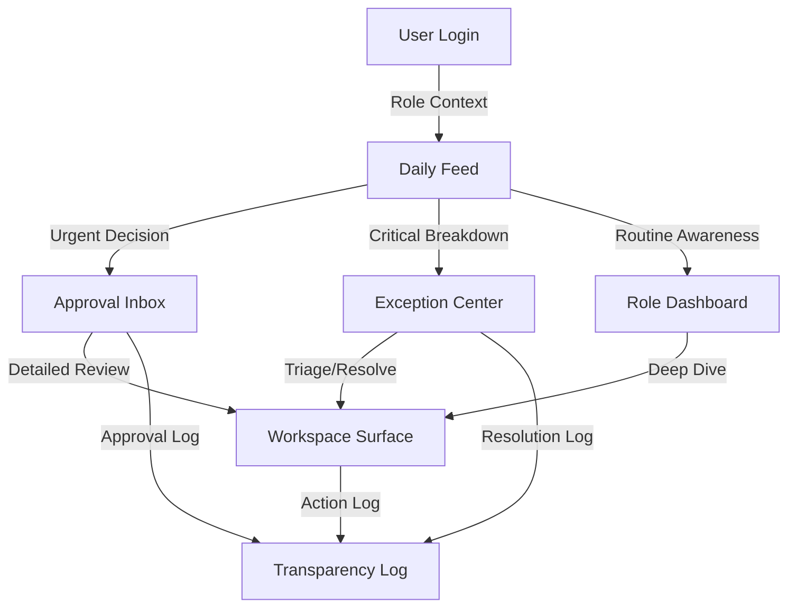

## Purpose

The Navigation Model in Mintrix is designed as an **Operating System** rather than a traditional application. It prioritizes the **Surface Family** (Daily Feed, Exception Center, etc.) over traditional "Module-First" navigation.

The goal is to move the user between surfaces based on their immediate operational need.

---

## 1. The Core Navigation Philosophy

-   **Surface-Centric**: Users navigate between **Surfaces** (The *What* and the *Why*) rather than just **Pages** (The *Where*).
-   **Contextual Routing**: A notification or a feed item should route the user directly to the appropriate **Workspace** or **Triage** surface.
-   **Identity-First**: The navigation is uniquely weighted for each persona's role (e.g., The Principal's primary navigation is the **Exception Center**).

---

## 2. Structural Navigation Components

### 1. The Left Rail (Global Navigation)
Persistent across all surfaces, providing access to the **Core Surface Set**:
-   **The Pulse**: Daily Feed.
-   **The Judgment**: Approval Inbox.
-   **The Triage**: Exception Center.
-   **The Summary**: Role Dashboard.
-   **The History**: Transparency Log.

### 2. The Command/Query Center
A global access point (e.g., `Cmd + K` or a floating action) for ad-hoc searching, retrieval, and "Chat & Query" actions.

### 3. Surface Transitions
-   **Feed → Workspace**: Tapping a "Class Briefing" in the feed opens the **Class Teaching Workspace**.
-   **Exception → Workspace**: Tapping an "Unresolved Consent" exception opens the **Event Console Workspace**.
-   **Dashboard → Exception**: Tapping a "Red" status in the **Role Dashboard** opens a filtered view in the **Exception Center**.

---

## 3. The Navigation Map (Surface Flow)

---

## 4. Design Rule: "One-Tap to Context"

Navigation should never feel like a "Hunt." If the system surfaces a risk or a recommendation, the user must be **exactly one tap away** from the context required to resolve it. The interface should avoid deep nesting of menus in favor of direct, surface-to-surface transitions.
