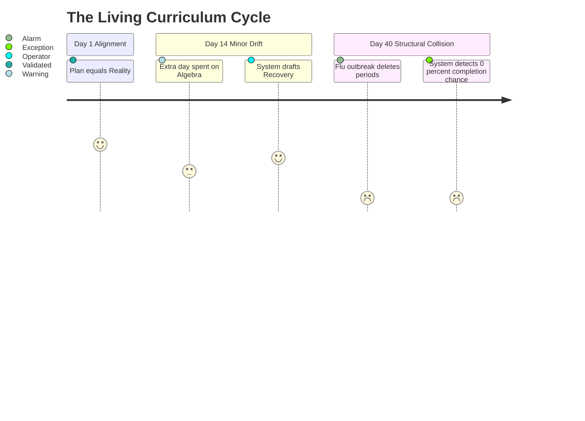

## Purpose

This document defines the **Living Curriculum State Architecture**.

In Mintrix, the "Curriculum" is not a static PDF or a linear checklist. It is a live, constantly calculating state vector. The system continuously cross-references the ideal syllabus plan against the grinding reality of the daily timetable.

---

## 1. The Curriculum Vector

The Living Curriculum State is calculated by continuously mapping three distinct inputs. If any of these inputs break, the vector becomes inaccurate, resulting in Exception generation.

<FeatureGrid>

<SurfaceCard title="Input A: The Static Substrate (The Plan)">
**Origin**: Setup Workspace (`Implementation`)
**Data**: Total chapters, topics, difficulty weightings, and the idealized number of periods required to complete them for a given Grade + Subject.
</SurfaceCard>

<SurfaceCard title="Input B: The Temporal Roster (The Time)">
**Origin**: Daily Operational Substrate.
**Data**: The actual live timetable. How many specific Math periods remain before the midterm exam? Has a holiday wiped out 3 upcoming periods?
</SurfaceCard>

<SurfaceCard title="Input C: The Execution Record (The Pace)">
**Origin**: Teacher Workspace (`Daily Logs`).
**Data**: The teacher's active confirmation that a topic was completed. Or, specifically, that a topic took 2 periods instead of the planned 1 period.
</SurfaceCard>

</FeatureGrid>

---

## 2. The Drift Calculation (The Delta)

Mintrix's primary academic value is accurately calculating the **Drift Delta** (where reality diverges from the plan) **before** it degrades into a crisis.

### 1. The "Safe" State
*   `Static Plan <= Temporal Roster`
*   **Behavior**: The system operates silently. The Teacher Workspace auto-recommends the exact next topic in the planner.

### 2. The "Warning" State (The Assistant)
*   `Static Plan > Temporal Roster (by < 10%)`
*   **Behavior**: The Teacher Workspace `Assistant` agent recommends consolidating specific low-weight topics to regain the timeline.

### 3. The "Exception" State (The Collaborator)
*   `Static Plan >> Temporal Roster (Mathematically Impossible)`
*   **Behavior**: A structural exception. The Teacher cannot resolve this alone. The system drafts a radical recovery path (e.g., "Schedule 3 extra weekend classes") and routes it to the Principal's Approval Inbox.

---

## 3. UI Alignment

The Living Curriculum State is expressed through the **Teacher Workspace Surface**. 
It relies heavily on the **Comparison View**:
*   *Current Reality*: "You are on Period 45."
*   *Ideal State*: "You should be on Period 48."

Because this system demands continuous inputs (Input C: Execution Record), the logging UI must be completely frictionless (`Tool` level simplicity), defaulting to "Yes, I taught the planned topic," with override sliders for "It took longer than expected."
