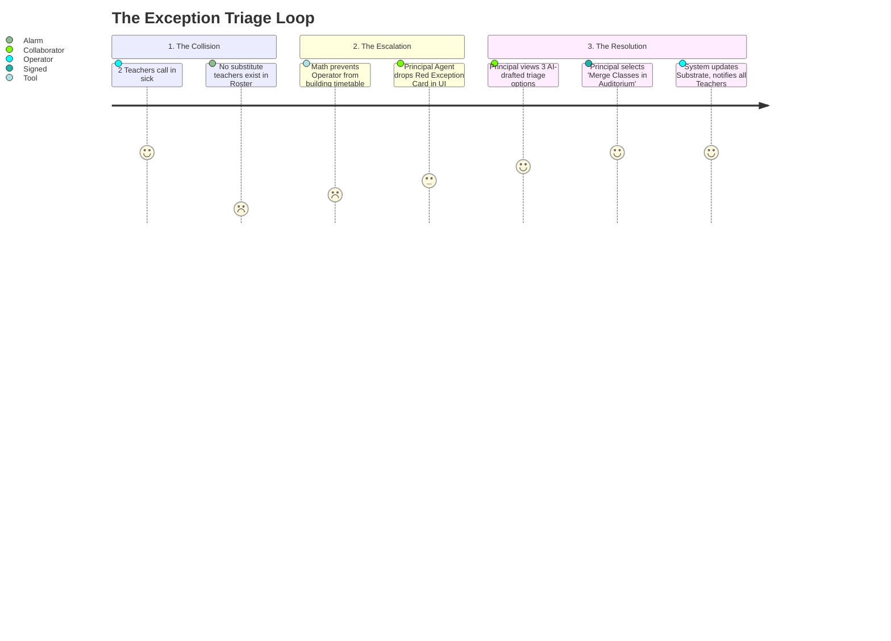

## Purpose

This document details the **Principal Operations and Exceptions** workflow.

The Principal is the ultimate arbiter of Trust in Mintrix. Their primary workflow is not data entry; it is high-speed, high-density decision making driven by the `Principal Agent`.

---

## 1. The Approval Inbox (The Judgment Workflow)

The defining screen for the Principal. They spend 80% of their operational time here, resolving actions where the AI lacks the legal or Trust clearance to fire autonomously.

### The Queue Structure
The Inbox is strictly sorted by the `Confidence Score` and `Severity Matrix` underlying the drafted actions, **not** by chronological time. A disciplinary suspension draft ranks higher than a request to buy printer paper.

### Interaction Model
1.  **View Draft**: Principal opens an `Amber Judgment Card` ("Suspend John Doe").
2.  **Access "View Why"**: The Principal Agent displays the rationale (e.g., *John has 4 strikes for fighting. Policy dictates suspension at 4. Teacher input confirms strike 4.*)
3.  **Execute**: Principal clicks "Sign & Execute". The action shifts back to `Operator` mode and permanently enters the `Transparency Log`.

---

## 2. The Exception Center (The Triage Workflow)

While the Inbox is for "Planned Interventions," the `Exception Center` is for "System Failures and Collisions."

If the Principal ignores the `Exception Center`, the school literally halts because the `Operator` engine refuses to guess how to solve a structural void.

---

## 3. The Role Dashboard (The Passive Workflow)

When the Principal is not actively signing drafts or triaging crises, they rely on the `Ambient Overview`.

*   **Behavior**: A fully read-only layout of rolling widgets.
*   **Data Density**: Highly compressed `Aggregation Engine` outputs. (e.g., *Total Weekly Absences vs. Average*, *Fee Collection Velocity*, *Syllabus Drift Index*).
*   **Transition**: If an anomalous trend is spotted on the dashboard, the Principal clicks the widget, which instantly transitions them into a deep `Workspace Surface` to investigate the root cause, abandoning passive mode for active execution mode.

---

## 4. Edge Cases: Competing Exceptions

When the school faces a systemic breakdown (e.g., a massive bus delay causing 400 late students), the system actively suppresses standard operations to prevent alarm fatigue.

*   **The Exception Funnel**: If the `Exception Center` detects more than 15 localized exceptions within a 5-minute window (e.g., 15 Teachers simultaneously logging that half their class is missing), it halts the individual ticket generation. It consolidates them into a single, massive `Macro-Event Card` for the Principal: *"Campus-Wide Attendance Anomaly Detected (40% absent across 15 classes)."*
*   **The Global Override**: From this Macro-Event Card, the Principal can hit a single `Global Override` button (e.g., "Mark all delayed students as 'Excused Weather Delay'"), instantly resolving all 15 downstream teacher conflicts and preventing 400 separate notifications from hitting parent feeds.
