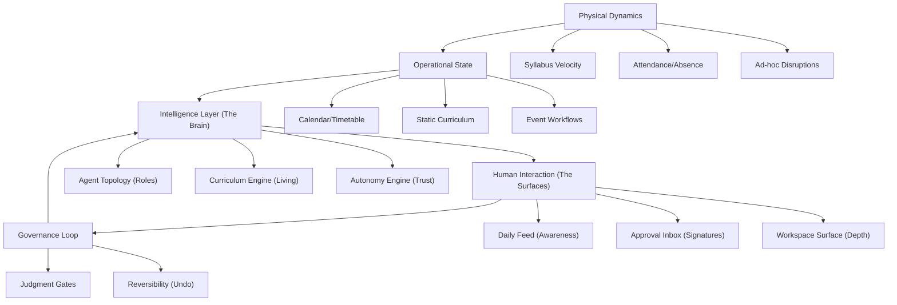

## Purpose

This document is the unified **Product Brief** for the Mintrix Educational AI Operating System.

It aligns product, design, and engineering on the full cognitive reality and surface architecture of the application. It acts as the ultimate root node for all structural decisions.

Everything in Mintrix is governed by the principles in this brief:
*What are the core systems, intelligent agents, execution loops, and control boundaries that elevate Mintrix from a traditional ERP to an **Editorial AI Operating System**?*

---

## 1. The Three Realities

Mintrix succeeds only when it seamlessly fuses three layers:

1. **Operational Reality**: The hard truth of school constraints (Time, Rosters, Venues, Payments).
2. **Intelligence Reality**: The system's ability to interpret signals, detect drift, and generate viable recovery paths.
3. **Human Judgment Reality**: The system's recognition of trust boundaries, demanding a human signature before enacting high-consequence paths.

If Mintrix stores records without understanding conditions, it is an ERP.
If Mintrix executes actions without trust boundaries, it is a liability.
If Mintrix possesses intelligence but lacks clear interfaces, it is unusable.

---

## 2. Core System Architecture

---

## 3. The Execution Lifecycle (The Universal Loop)

Mintrix unifies operations across all modules using a standardized execution cycle. Whether the issue is a failed payment or a lagging syllabus, the system acts using the exact same four-step cognitive engine:

<FeatureGrid>

<SurfaceCard title="Phase 1: Substrate Draft">
**Engine Action**: The Intelligence Layer detects a signal (e.g., *Class 10 is behind schedule* or *Teacher John called in sick*). It runs context queries against the Operational State and drafts a viable path/workflow.
</SurfaceCard>

<SurfaceCard title="Phase 2: Judgment Gate">
**Governance Action**: The Autonomy Engine checks the rule-set. 
*   If `Tool` -> Wait for human to manual input.
*   If `Collaborator` -> Route recommendation to the Approval Inbox. Suspend execution.
*   If `Operator` -> Bypass gate.
</SurfaceCard>

<SurfaceCard title="Phase 3: Active Execution">
**Interface Action**: The workflow is live. If human action is required, the execution moves into the **Workspace Surface** for deep focus. If system-led, the agent initiates notifications, calendar blocks, and dependencies.
</SurfaceCard>

<SurfaceCard title="Phase 4: Transparency Record">
**Memory Action**: The final state is hard-coded to the operational substrate. System-executed changes generate an immutable Event Card in the **Transparency Log** to preserve "View Why" auditing and reversibility.
</SurfaceCard>

</FeatureGrid>

---

## 4. Core Surface Families and Components

To expose the execution loop to the user, Mintrix relies on a small set of highly-reusable, mathematically structured UI surfaces powered by a foundational data component: the `Event Card`.

<FeatureGrid>

<SurfaceCard title="0. Event Cards" roles={["All Users"]} autonomy="Universal Component">
### Purpose
The fundamental atomic unit of information. Data, actions, logic, and intelligence are all packaged into standardized, self-contained cards (Awareness, Action, Judgment, Exception) which populate the Surfaces below.
</SurfaceCard>

<SurfaceCard title="1. The Daily Feed" roles={["Teacher", "Principal", "Admin", "Student", "Parent"]} autonomy="Assistant / Operator">
### Purpose
The primary, ambient surface providing highly compressed updates and proactive recommendations.
*   **Time-Anchored**: Organizes context linearly by the current day.
*   **Interaction Model**: Highly skimmable. Events here are low-density (Awareness).
</SurfaceCard>

<SurfaceCard title="2. The Approval Inbox" roles={["Principal", "Admin", "Teacher"]} autonomy="Collaborator">
### Purpose
The system's formal judgment surface. Any action the system drafts but lacks the authority to execute arrives here.
*   **Decision-First**: Every card demands explicit action using the **Comparison View** (`System Plan` vs. `Current Baseline`).
</SurfaceCard>

<SurfaceCard title="3. The Exception Center" roles={["Principal", "Admin"]} autonomy="Tool">
### Purpose
The triage surface for structural breakdowns, anomalies, and continuity risks where automation has failed.
*   **Severity-Anchored**: Sorted by impact radius. Uses aggressive UI language to demand resolution of conflicting data states.
</SurfaceCard>

<SurfaceCard title="4. Role Dashboards" roles={["Owner", "Principal", "Admin", "Teacher"]} autonomy="Tool / Assistant">
### Purpose
The persona-level structural summary (e.g., Health States, Financials).
*   **Stable Geometry**: Uses fixed-position widgets that summarize rolling health states. Read-heavy, heavily relying on drill-down interactions.
</SurfaceCard>

<SurfaceCard title="5. The Workspace Surface" roles={["Teacher", "Admin", "Principal"]} autonomy="Tool / Assistant">
### Purpose
The "Workbench" for highly focused execution around a specific object (A Class, An Event, A Student).
*   **Isolation**: Deep, persistent state management. AI Recommendations appear in an *Intelligence Sidebar* that the user pulls from.
</SurfaceCard>

<SurfaceCard title="6. The Transparency Log" roles={["Principal", "Admin", "Owner"]} autonomy="Operator">
### Purpose
The memory surface. This is where Mintrix proves it is not a "black box" by recording exactly what it did.
*   **Chronological**: Event Cards here display their full "View Why" rationale and maintain active "Undo/Reverse" buttons to correct past `Operator` behavior.
</SurfaceCard>

<SurfaceCard title="7. User Profile and Settings" roles={["All Users"]} autonomy="Maintenance">
### Purpose
The personalized control center defining notification cadence and historical array access.
*   **The Quiet UI**: Operates outside global execution loops, allowing humans to throttle AI verbosity and configure domain-specific parameters.
</SurfaceCard>

</FeatureGrid>

---

## 5. UI Screen Design Rules

Before individual screens are designed in Figma or code, the following architectural laws apply:

### 1. The Component Precedes the Page
Do not design a "Transport Page." Design the *Workspace Surface* and populate it with *Event Cards*. Repeatable architectural blocks (`<FeatureGrid>`, `<SurfaceCard>`, The Intelligence Sidebar) are global.

### 2. Autonomy Mandates UI
If an element is acting as a `Collaborator`, it **must** spawn in the Approval Inbox (or visibly halt workflow in the Workspace) and demand a signature. If it is an `Operator`, it must silently output a receipt to the Transparency Log. UI components change visually based on their underlying autonomy map.

### 3. Setup is the Trust Baseline
Onboarding and data configuration is not an "admin setting." It is the primary operating surface that calibrates the system's Confidence levels. A poorly set-up system limits execution vectors, surfacing "Calibration Warning" cards across all user feeds.
