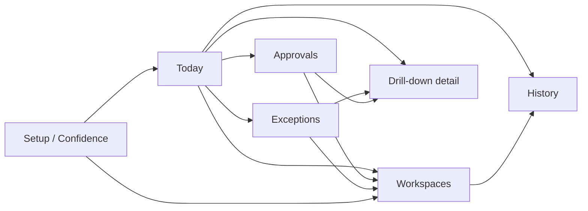

## Purpose

This document defines the first coherent screen inventory and navigation model for Mintrix.

It is meant to bridge system thinking and actual UI design.

It answers:

- which screens should exist in the first design wave,
- which persona each screen serves,
- what the primary job of each screen is,
- and how users should move through the product without it becoming a module-heavy ERP shell.

This is not a complete sitemap for every future feature. It is a first-wave screen architecture aligned to the operating-system model.

---

## Navigation Thesis

Mintrix should not use traditional ERP navigation as its primary organizing logic.

The product should be navigated through a small number of action-centered entry points:

- what matters now,
- what needs my decision,
- what is going wrong,
- what I am responsible for,
- and what I need to investigate more deeply.

That means navigation should be:

- role-aware,
- shallow at the top level,
- and consistent across personas.

---

## Top-Level Navigation Model

The recommended top-level navigation model for internal school personas is:

1. `Today`
2. `Approvals`
3. `Exceptions`
4. `Workspaces`
5. `History`
6. `Setup` or `System Confidence` for eligible roles

This creates a reusable shell for Principal, Admin, and Teacher with role-specific content inside each area.

Owner, Student, and Parent can receive lighter variants.

---

## First-Wave Screen Inventory

## Teacher screens

| Screen | Primary job | Surface family | Priority |
| --- | --- | --- | --- |
| Teacher daily dashboard | Show today’s classes, risks, recommendations, and upcoming changes | Daily feed | P0 |
| Class teaching workspace | Help the teacher understand class state, topic progress, and recommended adjustments | Workspace | P0 |
| Student intervention workspace | Show learner signals, suggested supports, and follow-up options | Workspace | P1 |
| Attendance follow-up view | Review absent students and send or approve next actions | Workspace / exception | P1 |
| Teacher approval tray | Review parent communication or intervention items needing sign-off | Approval inbox | P1 |
| Teacher history/log view | See recent AI actions and prior decisions | Transparency log | P2 |

## Principal screens

| Screen | Primary job | Surface family | Priority |
| --- | --- | --- | --- |
| Principal morning brief | Summarize school risk, drift, disruptions, and pending decisions | Daily feed | P0 |
| Principal exception center | Triage academic and operational risks | Exception center | P0 |
| Principal approval inbox | Resolve high-sensitivity actions and escalations | Approval inbox | P0 |
| Academic health dashboard | See curriculum drift and class-level health | Role dashboard | P1 |
| Event oversight workspace | Track event readiness, risk, and dependencies | Workspace | P1 |
| Principal action history | Review system decisions and outcomes | Transparency log | P2 |

## Admin screens

| Screen | Primary job | Surface family | Priority |
| --- | --- | --- | --- |
| Admin daily operations dashboard | Show attendance, substitutions, notices, reminders, and operational tasks | Daily feed | P0 |
| Setup and confidence tracker | Show setup status, missing data, and current automation readiness | Setup/confidence | P0 |
| Timetable and substitution workspace | Resolve schedule gaps and continuity issues | Workspace | P1 |
| Notices and communication workspace | Prepare, approve, and track notices | Workspace | P1 |
| Event operations workspace | Manage event primitives, tasks, and dependencies | Workspace | P1 |
| Admin transparency log | Audit what the system has already executed | Transparency log | P2 |

## Owner screens

| Screen | Primary job | Surface family | Priority |
| --- | --- | --- | --- |
| Institutional overview | Show school or campus health and intervention signals | Role dashboard | P1 |
| Strategic risk summary | Surface drift, reputation risk, and major unresolved issues | Daily feed / dashboard | P1 |
| Executive history view | Review key automated and approved actions | Transparency log | P2 |

## Student screens

| Screen | Primary job | Surface family | Priority |
| --- | --- | --- | --- |
| Student daily learning view | Show what to study, what changed, and support prompts | Daily feed | P2 |
| AI tutor workspace | Deliver guided academic help | Workspace | P2 |

## Parent screens

| Screen | Primary job | Surface family | Priority |
| --- | --- | --- | --- |
| Parent action center | Show important communication, consent, and payment tasks | Daily feed / task center | P2 |
| Parent history and updates | Show notices, event changes, and prior communications | History | P3 |

---

## Recommended Design Sequence

The first design wave should focus on the following seven screens:

1. Teacher daily dashboard
2. Class teaching workspace
3. Principal morning brief
4. Principal approval inbox
5. Principal exception center
6. Admin setup and confidence tracker
7. Transparency log

These screens are enough to establish:

- proactive intelligence,
- mixed autonomy,
- anti-UI behavior,
- curriculum awareness,
- operational visibility,
- and system trust.

---

## Navigation Flow Model

---

## Entry Point Logic by Persona

| Persona | Primary entry point | Secondary entry point |
| --- | --- | --- |
| Teacher | Today | Workspaces |
| Principal | Today | Approvals / Exceptions |
| Admin | Today or Setup | Workspaces |
| Owner | Overview dashboard | History / strategic detail |
| Student | Daily learning view | Tutor workspace |
| Parent | Action center | Updates/history |

---

## Navigation Rules

### 1. Keep top-level navigation shallow

The system should not expose dozens of top-level modules.

Top-level nav should stay small and behavior-based.

### 2. Use drill-downs, not endless sibling modules

Deeper workflow complexity should live inside workspaces and detail views, not as a flat set of independent sections.

### 3. Preserve surface consistency across roles

Even when content changes by persona, the meaning of:

- `Today`
- `Approvals`
- `Exceptions`
- `History`

should stay consistent.

### 4. Let urgency shape routing

Notifications and alerts should route users to:

- Approvals, if judgment is required
- Exceptions, if something is broken or risky
- Workspaces, if execution depth is needed

### 5. Hide low-priority areas until they are earned

Do not expose a large shell of empty or low-value navigation areas simply to look complete.

---

## Screen-Level Content Expectations

<FeatureGrid>
<FeatureCard title="Today screens should contain">
- what matters now
- time-based context
- prepared recommendations
- pending decisions
- upcoming disruptions
</FeatureCard>

<FeatureCard title="Approval screens should contain">
- action summary
- rationale
- impact
- ownership
- approval and rejection paths
</FeatureCard>

<FeatureCard title="Exception screens should contain">
- severity
- cause
- downstream risk
- suggested resolution paths
- escalation options
</FeatureCard>

<FeatureCard title="Workspace screens should contain">
- deep object context
- current state
- recommended next actions
- manual controls
- related history
</FeatureCard>

<FeatureCard title="History screens should contain">
- past actions
- triggers
- explanations
- changes over time
</FeatureCard>
</FeatureGrid>

---

## Anti-Patterns to Avoid

- a module-heavy left nav with sections like academics, fees, notices, events, analytics, users, settings all exposed equally
- separate dashboards for every topic before the shared surface model is stable
- chat as the only way to reach intelligence
- burying trust and action history inside obscure settings or admin tools
- building owner analytics before teacher, principal, and admin loops are coherent

---

## Pre-UI Decisions to Lock

Before screen design begins, the team should confirm:

1. the first-wave screen list
2. the role-aware top-level navigation model
3. the relationship between daily feed, approvals, exceptions, and workspaces
4. how history and transparency are surfaced
5. which roles can access setup/confidence views

Once these are locked, screen design can proceed much faster and with far less rework.

