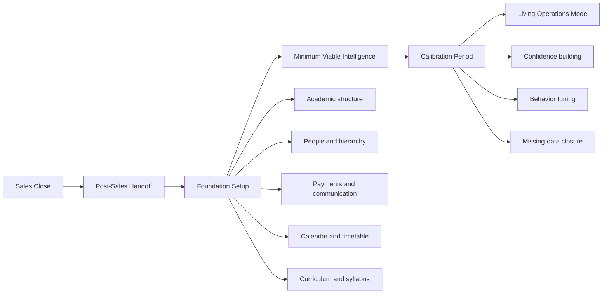
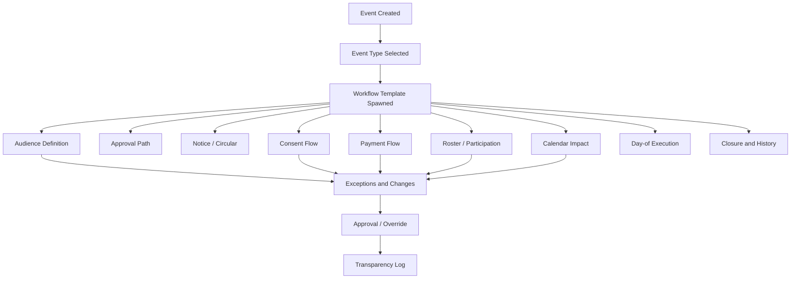

# Mintrix Setup and Event Architecture Map

## Purpose

This document maps the setup and event architecture of Mintrix as a first-class system layer.

It is based on the Mintrix setup and event management document, the audit report, and the current product synthesis. It should be treated as a working architecture reference, not a final technical specification.

Its goal is to define:

- how schools are brought into Mintrix,
- how the system becomes useful before setup is fully complete,
- how real-world school events are modeled,
- and how changing operational reality is handled without breaking continuity.

---

## Core Thesis

Setup and event management are not secondary admin features.

They are the substrate on which the system’s intelligence becomes believable.

If setup is weak:

- Mintrix feels generic.

If calibration is weak:

- Mintrix feels unreliable.

If event handling is weak:

- Mintrix collapses under real school chaos.

---

## 1. Setup Architecture

## Setup Goals

The setup experience must achieve four things:

1. capture institutional truth,
2. create enough structure for early intelligence,
3. avoid overwhelming staff in the first 30 days,
4. progressively deepen system confidence as more information arrives.

## Setup Lifecycle

## Setup Phases

<SurfaceCard title="Phase 1: Post-sales handoff">
Goal:

- transfer institutional context from commercial promise to operational truth

Outputs:

- school profile
- expected deployment scope
- known operating quirks
- priority use cases
- leadership stakeholders

Risks:

- losing context between sales and onboarding
- setting wrong expectations for first-week product behavior
</SurfaceCard>

<SurfaceCard title="Phase 2: Foundation setup">
Goal:

- define the durable structure the intelligence layer depends on

### Working five-layer setup model

This five-layer model is a working synthesis from the accessible source material and should be validated further if the full setup document is re-extracted line by line.

| Layer | What is configured | Why it matters |
| --- | --- | --- |
| `Layer 1: Institutional structure` | campus, grades, sections, terms, reporting hierarchy | defines the school’s permanent shape |
| `Layer 2: Academic model` | subjects, syllabus, curriculum mapping, timetable backbone | creates the basis for living curriculum |
| `Layer 3: People and permissions` | staff roles, authority boundaries, parent/student relationships | shapes agent behavior and visibility |
| `Layer 4: Operations and finance` | fee heads, notice rules, attendance rules, communication defaults | supports routine school coordination |
| `Layer 5: Live operational hooks` | event templates, substitutions, ad-hoc payment logic, workflow triggers | lets the system operate in real time |
</SurfaceCard>

<SurfaceCard title="Phase 3: Minimum viable intelligence">
Goal:

- deliver visible value before full setup is complete

Examples:

- attendance summary
- first pace snapshots
- communication preparation
- early fee follow-up support
- role-shaped daily briefings

Core principle:

- the school should feel useful intelligence in week one, not only after total configuration
</SurfaceCard>

<SurfaceCard title="Phase 4: Calibration period">
Goal:

- let the system learn the school’s actual rhythm over the first 2-4 weeks

What changes here:

- confidence in agent recommendations
- trust in schedule and attendance patterns
- understanding of communication norms
- event handling quality
- exception detection quality

Calibration signals:

- which workflows keep failing
- which reminders are ignored
- where configuration is incomplete
- which roles need more guidance
- where human overrides are common
</SurfaceCard>

<SurfaceCard title="Phase 5: Living operations mode">
Goal:

- move from setup into steady-state school operation

At this stage the system should handle:

- substitutions
- notices
- new admissions
- short-term events
- ad-hoc payments
- day-to-day operational drift
</SurfaceCard>

---

## 2. Configuration Model

## Foundation configuration

Rarely changed, system-defining inputs:

- school structure
- section model
- calendar model
- syllabus model
- fee model
- authority hierarchy

## Living configuration

Frequently changed, operational inputs:

- timetable changes
- absences and substitutions
- notices and circulars
- events and competitions
- ad-hoc payments
- event-specific rosters

## Architecture implication

Mintrix should never treat living configuration as an afterthought. It is where the school becomes real.

---

## 3. Event Architecture

## Event Thesis

School events should be modeled as typed workflows, not one-off admin tasks.

That means every event type should inherit a shared architecture while still supporting type-specific behavior.

## Event Types

| Event type | Examples | Shared components |
| --- | --- | --- |
| School trips | local trip, outstation trip, excursion | notice, consent, payment, roster, attendance, schedule |
| Competitions | olympiads, contests, academic competitions | targeting, registration, preparation, fee, result tracking |
| Tournaments | sports events, multi-date competitions | team formation, logistics, schedule, attendance, outcomes |
| Co-curriculars | club programs, workshops, recurring activities | enrollment, attendance, progress, notices |
| Notices and circulars | general communication | audience, acknowledgment, follow-up |
| Ad-hoc payment events | one-time charges for activities or logistics | obligation, parent communication, reconciliation |

## Event Engine Map

## Shared primitives for all events

- audience
- role ownership
- approval path
- communication object
- acknowledgment state
- payment object if needed
- participation roster
- calendar footprint
- exception list
- transparency log

## Type-specific examples

<FeatureGrid>
<FeatureCard title="School trip">
Must support:

- circular
- parent consent
- payment link
- participant roster
- teacher/staff assignment
- day-of attendance and safety visibility
- closure summary
</FeatureCard>

<FeatureCard title="Olympiad">
Must support:

- candidate targeting
- parent/student registration
- preparation reminders
- participation fee if needed
- result logging
</FeatureCard>

<FeatureCard title="Tournament">
Must support:

- team composition
- multi-date schedule
- logistics planning
- attendance and transport considerations
- results and achievement ledger
</FeatureCard>

<FeatureCard title="Notice or circular">
Must support:

- recipient segmentation
- acknowledgment tracking
- reminder logic
- history trail
</FeatureCard>

<FeatureCard title="Ad-hoc payment workflow">
Must support:

- reason for charge
- linked event or activity
- parent view
- outstanding state
- reconciliation view for admin
</FeatureCard>
</FeatureGrid>

---

## 4. Event States

Every typed event should move through consistent state gates:

| State | Meaning |
| --- | --- |
| `Draft` | Event exists but is not ready for operational flow |
| `Prepared` | Audience, logic, and assets are assembled |
| `Pending approval` | Needs human judgment before release |
| `Active` | Notices, consents, payments, and rosters are live |
| `Exception state` | Something changed or failed |
| `Execution day` | Event is currently happening |
| `Closed` | Event is complete and archived with traceability |

---

## 5. Exception and Override Design

Setup and event architecture both need strong exception handling.

## Common setup exceptions

- missing foundation data
- contradictory authority mappings
- incomplete curriculum mapping
- fee model mismatch
- timetable inconsistency

## Common event exceptions

- late participant changes
- missing consent
- unpaid participation
- venue/date change
- staff reassignment
- roster mismatch

## Rule

The system should automatically handle routine updates, but surface exceptions when:

- safety is involved,
- money is involved,
- public communication changes,
- curriculum continuity is affected,
- or authority ambiguity exists.

---

## 6. Interaction Surfaces for Setup and Events

| Surface | Best use |
| --- | --- |
| Guided onboarding flow | foundation setup and step sequencing |
| Setup status dashboard | missing data, confidence, readiness |
| Calibration panel | what the system has learned and what remains weak |
| Event command view | full event state and dependencies |
| Approval inbox | notices, releases, sensitive changes |
| Exception dashboard | unresolved event or setup conflicts |
| Transparency log | system-handled reminders, updates, and routine actions |

---

## 7. Architecture Outputs This Document Should Drive

This architecture map should directly lead to:

1. setup journey wireframes,
2. calibration-state design,
3. event template definitions,
4. exception taxonomy,
5. trust and approval rules for event actions,
6. data model planning for event primitives.

---

## Final Working Position

Mintrix setup and event architecture should be designed as a continuous intelligence substrate.

That means:

- setup is progressive, not one giant form,
- calibration is expected, not treated as failure,
- events are typed systems, not ad hoc tickets,
- and every change in school reality should be able to enter the system without breaking continuity.

If this layer is strong, Mintrix feels like it knows the school.

If this layer is weak, everything above it feels generic.
