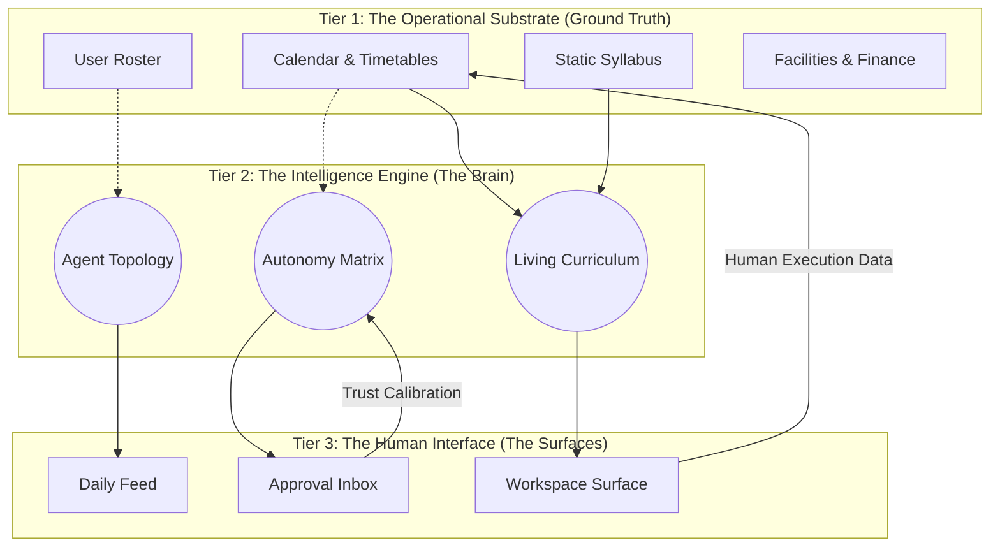

## Purpose

This document defines the macro **System Architecture** of the Mintrix platform. 

It maps how data flows from origin (real-world school chaos) through the Intelligence Engine (the computational brain), and ultimately resolves into the Human Interfaces (the UI Surfaces). This acts as the structural blueprint for how all separate micro-architectures (Events, Curriculums, Setup) interact.

---

## 1. The Three-Tier Execution Model

Mintrix operates fundamentally differently from a CRUD (Create, Read, Update, Delete) database. It runs on a **Draft -> Reason -> Execute** model.

---

## 2. Component Analysis

### Tier 1: The Operational Substrate
The hard, objective data of the school. If this layer is inaccurate (see `1. Setup Architecture.md`), the entire system degrades.
*   **Design Rule:** Data here must be highly relational. An absence here is not a text string; it is a structural void that impacts timetables, fee ledgers, and event rosters.

### Tier 2: The Intelligence Engine
The layer that differentiates Mintrix from traditional software. It does not just store data; it actively interprets it.
*   **The Processor:** Continuously runs anomaly detection across the substrate. 
*   **The Agents:** Packages intelligence specifically for a role (The Principal Agent processes data differently than the Teacher Agent).
*   **The Autonomy Governance:** Measures the math. If severity is high and confidence is low, it refuses to act and routes to Tier 3.

### Tier 3: The Human Interface
The UI surfaces designed exclusively through the **Editorial Intelligence** design system.
*   **Design Rule:** System output must be natively scannable (`<FeatureGrid>`), provide deep rationale on demand ("View Why"), and clearly demarcate human authority (Reversibility).

---

## 3. The Central Information Arteries

How data moves between the three tiers is strictly governed by pre-defined UI mechanisms.

<FeatureGrid>

<SurfaceCard title="The Awareness Artery (Feed)">
**Flow**: `Tier 2 -> Tier 3 (Daily Feed)`
**Logic**: The system compresses non-urgent intelligence (`Operator` log receipts, routine `Assistant` recommendations) into an ambient, highly compressed flow for passive consumption.
</SurfaceCard>

<SurfaceCard title="The Judgment Artery (Inbox/Exception)">
**Flow**: `Tier 2 -> Tier 3 (Approval Inbox)`
**Logic**: A hard stop. The system has drafted an action but lacks the Autonomy threshold to execute it. Data flow is paused indefinitely until a human provides an explicit signature via the Comparison View.
</SurfaceCard>

<SurfaceCard title="The Execution Artery (Workspace)">
**Flow**: `Tier 3 -> Tier 1`
**Logic**: Deep human focus. The user utilizes an Intelligence Sidebar to pull contextual data, but ultimately executes complex, multi-step workflows (like lesson planning) that overwrite the Operational Substrate.
</SurfaceCard>

</FeatureGrid>

---

## 4. Architectural Summary

Mintrix is an event-driven intelligence loop. 

A teacher logging an absence in a Workspace (Tier 3) updates the Substrate (Tier 1). The Intelligence Engine (Tier 2) detects a sequential anomaly (the student has missed 4 days), calculates risk, drafts a parent intervention email, routes it through the Autonomy Engine, determines it is high-sensitivity (`Collaborator`), and places it seamlessly into the Principal's Approval Inbox (Tier 3).
