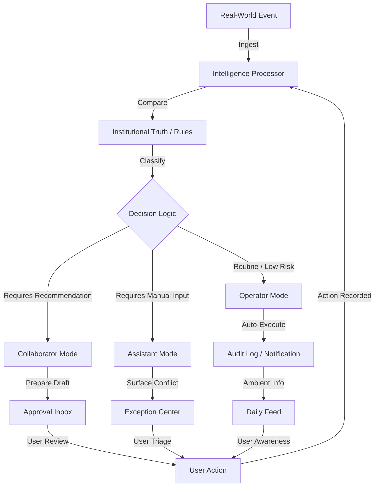

## Purpose

This document explains the internal mechanics of Mintrix: how it processes school reality, how its agents act autonomously, and how users interact with that intelligence through a unified flow.

It bridges the gap between the **Architecture Map** (surfaces) and the **Workflow and Persona** (autonomy levels).

---

## 1. How the System Operates

Mintrix is not a database with a UI; it is an **event-driven intelligence layer** that sits on top of school operations.

The system operates on a **Observe → Orient → Decide → Act** (OODA) loop:

1.  **Observe**: Ingest raw data (attendance, fees, syllabus progress, parent messages).
2.  **Orient**: Compare raw data against "Institutional Truth" (timetables, policies, historical patterns).
3.  **Decide**: Determine if the situation is routine (Operator), needs a recommendation (Collaborator), or requires manual triage (Assistant).
4.  **Act**: Update the Daily Feed, send a notification, or prepare an Approval Item.

---

## 2. Event Processing Architecture

Events in Mintrix are more than logs; they are the "heartbeat" of the school.

### The Event Lifecycle

| Stage | Action | System Behavior |
| :--- | :--- | :--- |
| **Ingestion** | A teacher marks a student absent. | The raw "Absence Event" enters the system. |
| **Contextualization** | System checks student history and parent profile. | "Is this a pattern? Is there a pre-approved leave?" |
| **Intelligence Routing** | System classifies the event severity. | "Routine absence" vs. "Critical attendance drift." |
| **Surface Delivery** | System places the event in the right surface. | Routine → Daily Feed; Critical → Exception Center. |

---

## 3. Autonomous Agent Personas

Every user in Mintrix has a **Shadow Agent**. This agent is role-shaped and behaves differently based on the persona's mission.

### Agent Behaviors

-   **The Principal's Agent**: Focuses on *coherence and risk*. It scans for "friction" between departments and escalates them to the Exception Center.
-   **The Teacher's Agent**: Focuses on *preparedness and empathy*. It drafts parent communications and lesson reinforcements before the teacher even asks.
-   **The Admin's Agent**: Focuses on *continuity and completion*. It handles high-frequency routines like fee reminders and substitution logic.

### Autonomy Guardrails

Agents operate under a **Governance Rule**:
-   **Low-Risk/High-Frequency**: Agent acts as an **Operator** (e.g., sending a routine fee reminder).
-   **High-Risk/Context-Heavy**: Agent acts as a **Collaborator** (e.g., suggesting a disciplinary intervention but waiting for a human signature).

---

## 4. User Interaction Surfaces

Users do not "browse" Mintrix; they "respond" to it.

1.  **Daily Feed (The Pulse)**: What do I need to know *now*?
2.  **Approval Inbox (The Judgment)**: What has the system prepared that needs my *signature*?
3.  **Exception Center (The Triage)**: What is *breaking* that needs my active problem-solving?
4.  **Intelligence Cards (The Deep Dive)**: Show me the *truth* behind a specific entity (Student, Class, Campus).

---

## 5. Overall User Flow

This chart shows how a real-world event traverses the system to reach the user.

---

## 6. System Health & Calibration

The system's intelligence is only as good as its **Calibration**.
-   **Early Phase**: The system acts mostly as an *Assistant*, asking for confirmation often.
-   **Mature Phase**: As confidence grows, more workflows move to *Operator* status, freeing humans for high-leverage work.
