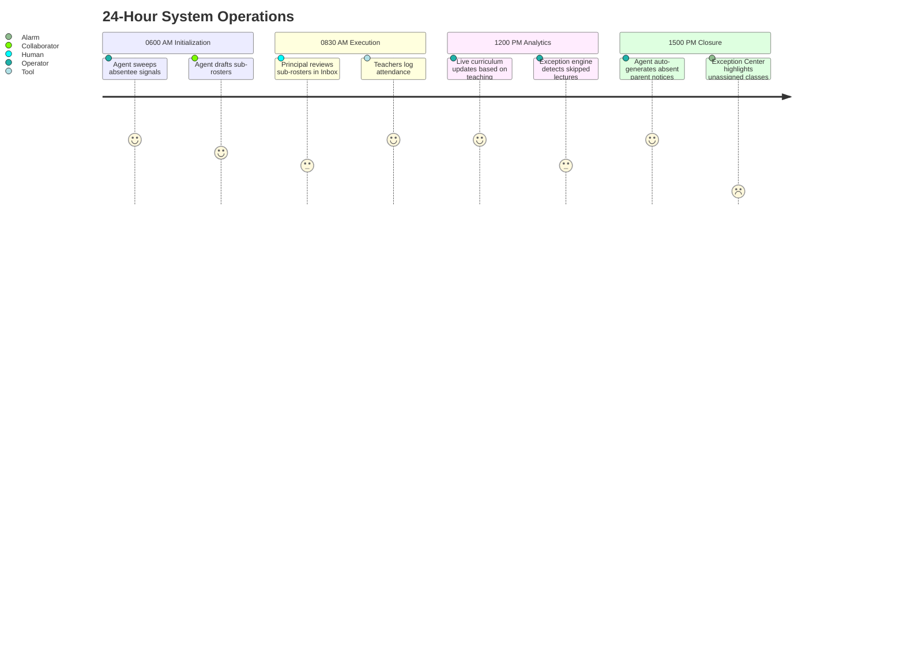

## Purpose

This document defines **System Operations**, illustrating the macro chronological cycle of the Mintrix platform. 

Mintrix models the school as a living organism across three temporal rhythms: The Daily Grind, The Weekly Assessment, and The Term Cycle.

---

## 1. The Daily Grind (Operational Rhythm)

The system manages the extreme density of daily operations using the `Admin Agent` and the `Teacher Agent`.

### Key System Responsibilities:
1.  **Frictionless Bootup**: Sub-rosters and event dependencies must be processed by the intelligence engine *before* 8:00 AM.
2.  **Daily Substrate Wipe**: The system must resolve all pending Attendance/Notice acknowledgments linearly, routing remaining gaps to an override queue.

---

## 2. The Weekly Assessment (Intelligence Rhythm)

The system shifts from immediate operational panic to intelligence consolidation.

### Key System Responsibilities:
1.  **The Drift Calculation**: The `Living Curriculum Engine` aggregates the week's pace. Did Class 10 hit the required 4 milestones? If not, the system drafts a recovery path.
2.  **The Intervention Scan**: The system collates weekly test scores and behavioral marks. If a student drops consistently across 2 subjects, the `Principal Agent` flags them for an Intervention.
3.  **The Trust Recalibration**: The Autonomy Engine reviews the `Transparency Log`. Were 100% of the AI's fee reminders sent without a human clicking "Undo"? If yes, the confidence score for the Fee Module increases.

---

## 3. The Term Cycle (Setup Rhythm)

The macro transition where the 5 Layers of Setup are entirely redefined.

### Key System Responsibilities:
1.  **The Clean Slate**: Elevating students to the next grade, resetting the syllabus tracking to 0, and archiving the former Temporal Substrate.
2.  **Setup Vulnerability**: Because thousands of data points are shifting simultaneously, nearly all Autonomous `Operator` functions temporarily degrade to `Collaborator` mode. The system effectively demands that humans double-check the first wave of automated timetables, fee drafts, and event logic to ensure the new Term's foundation is structurally sound before locking it in continuously.

By strictly categorizing operations into Daily, Weekly, and Term structures, the development team knows exactly *when* certain AI calculations should be triggered, minimizing server load and maximizing user relevance.
