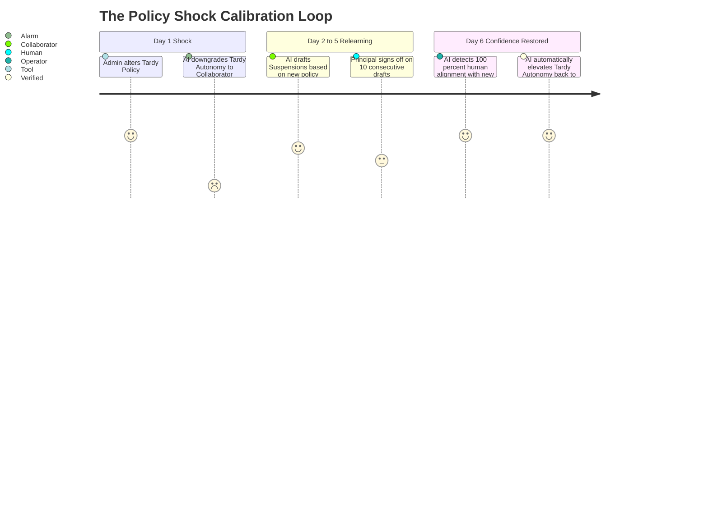

## Purpose

This document outlines the **Tuning and Policies** workflow.

Mintrix relies on intelligent tuning rather than static backend settings. When an Admin updates a policy, they trigger a cascade of systemic realignments across the Autonomy Engine.

---

## 1. The Policy Adjustment Workflow

Mintrix forces human Admins to explicitly manage the AI's boundaries.

### Step 1: Modifying the Ground Truth
The Admin enters the `Setup Workspace` and navigates to the core parameter blocks. 
*Example:* They change the "Acceptable Late Protocol" from **3 Tardy Marks = Warning** to **2 Tardy Marks = Suspension**.

### Step 2: The "Shock" Calibration
The system detects a fundamental shift in Layer 2 Setup (Policy).

### Step 3: Global Notification
When the Admin commits the Policy Shock, the `Admin Agent` instantly drafts an `Awareness Card` and drops it into the `Daily Feed` of all relevant users (Parents, Students, Teachers) outlining the precise rule change, ensuring perfect institutional alignment before the new penalty is enforced.

---

## 2. The Tone Tuning Workflow

If a human repeatedly edits the language of `Assistant` drafts, the system must be manually or automatically tuned to match.

1.  **Manual Override**: An Admin enters the `Setup Workspace` under "Intelligence Behaviors". They use slider components to shift the Semantic Processor's tone from `Strict` to `Warm`.
2.  **Immediate Re-Drafting**: The system retroactively scans any pending drafted communications in the `Approval Inbox` and instantly re-writes them using the new Tone parameters, updating the `Comparison Views` before the Principal even hits Approve.
3.  **Visual Confirmation**: The UI briefly pulses with an `Intelligence Calibration State` badge, proving the AI structure has synced with the new parameters.
